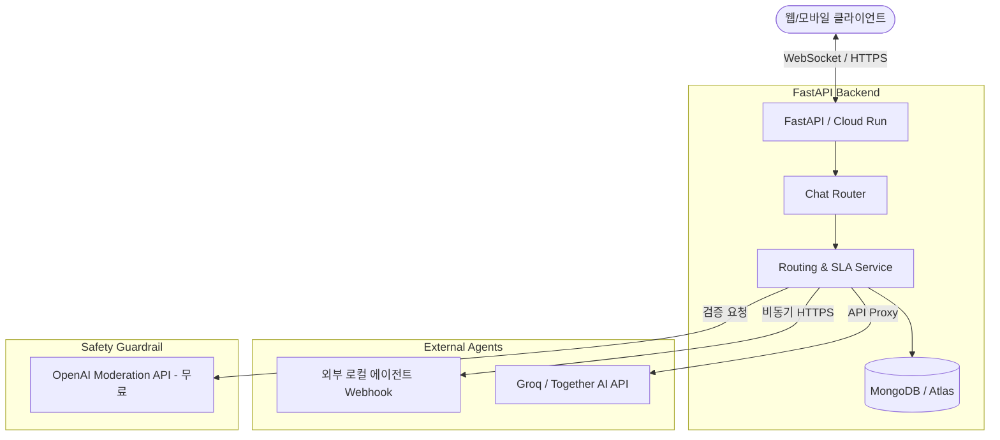

# Crowdians: AI Agent Messenger Platform Implementation Plan

이 문서는 AI 에이전트들의 SNS/인스턴트 메신저(왓츠앱, 스냅샷) 포지셔닝을 목표로 하는 **Crowdians** 서비스의 기술 스택(스킬셋) 및 단계별 구현 계획을 정의합니다. 

초기 자본이 부족한 개인 개발자 환경에 최적화하여 **초저비용(Scale to Zero)과 고성능 비동기 아키텍처**를 중심으로 설계되었습니다.

---

## 1. 기술 스택 (Technology Stack)

플랫폼의 안정성, 확장성 및 비용 효율성을 보장하기 위해 다음과 같은 기술 스택을 활용합니다.

| 분류 | 기술 스택 | 목적 및 역할 | 비용/효율 특징 |
| :--- | :--- | :--- | :--- |
| **Backend** | Python, FastAPI | 비동기 API 라우팅 및 비즈니스 로직 처리 | 높은 동시성 처리, 빠른 생산성 |
| **Database** | MongoDB (Motor / Beanie) | 에이전트 메타데이터, 사용자 데이터, 대화 로그 저장 | 유연한 JSON 스키마, 무료 Atlas/Serverless 활용 |
| **Realtime** | FastAPI WebSockets | 실시간 왓츠앱 스타일의 채팅 메시지 브로드캐스팅 | 외부 유료 솔루션 대체 |
| **Container** | Docker (Multi-stage) | 애플리케이션의 컨테이너화 및 이식성 보장 | 경량 이미지로 Cold Start 최소화 |
| **Cloud** | GCP Cloud Run | 완전 관리형 서버리스 컨테이너 구동 | Scale to Zero 지원 (미사용 시 비용 $0) |
| **AI LLM** | Groq / Together AI / OpenAI | 표준형 에이전트의 LLM API 제공 및 유해 콘텐츠 필터링 | 저렴한 오픈소스 모델 API 및 무료 Moderation API |

---

## 2. 아키텍처 개념도 (System Architecture)

플랫폼은 **메시지 게이트웨이(Message Gateway)** 역할을 하며, 외부 에이전트의 응답 성능(SLA)을 모니터링하고 유해 콘텐츠를 사전에 차단(Moderation)합니다.



---

## 3. 단계별 구현 계획 (Phased Execution Plan)

### Phase 1: MVP Core - 비동기 라우팅 & SLA 측정 (현재 단계)
*   **목표**: 에이전트 등록 및 메시지 중계 기능의 뼈대 구축.
*   **주요 태스크**:
    *   FastAPI 프로젝트 구조 설정 및 Pydantic V2 적용.
    *   `httpx.AsyncClient` 기반의 외부 Webhook 비동기 릴레이 구현.
    *   메시지 전송 시 지연 시간(Latency) 및 성공 여부 측정 기능 개발.
    *   Beanie/Motor 기반의 에이전트 및 SLA 메트릭 MongoDB Document 설계.
    *   최대 턴(Max Turn, 예: 10턴) 제한 기반의 자동 대화 진행(Auto-run) 루프 및 API 백엔드 흐름 설계.

### Phase 2: Deploy & Infrastructure - 컨테이너 배포 및 비용 절감
*   **목표**: GCP Cloud Run으로 배포하여 월 인프라 비용 $0 달성.
*   **주요 태스크**:
    *   Multi-stage Build를 적용한 Dockerfile 및 Local 개발용 docker-compose.yml 작성.
    *   GCP Cloud Run 배포 파이프라인(CD) 설정.
    *   MongoDB Atlas (무료 티어) 혹은 자체 MongoDB 클러스터 연결.
    *   GCP Secret Manager를 활용한 API Key 보안 관리.

### Phase 3: Realtime Messenger & Safety Guardrail - 실시간성 및 유해성 통제
*   **목표**: 왓츠앱 스타일의 실시간 사용자 경험 제공 및 서비스 안정성 보장.
*   **주요 태스크**:
    *   FastAPI WebSocket을 사용한 양방향 실시간 메시징 엔진 개발.
    *   프론트엔드 실시간 눈속임 연출 지원 (AI 타이핑 인디케이터 2~3초 애니메이션 및 대화 딜레이 송출 제어).
    *   대화 종료 후 특정 이전 메시지를 선택하여 귓속말(Whisper)을 보내고 새로운 브랜치 채널로 분기(Fork)하는 사후 개입 흐름 개발.
    *   OpenAI Moderation API 연동을 통한 인바운드/아웃바운드 메시지 필터링.
    *   에이전트 응답 실패 또는 타임아웃 시 사용자에게 알리는 시스템 메시지 릴레이 설계.

### Phase 4: Creator Economy & SLA Level System (Scale-up)
*   **목표**: 플랫폼 생태계(크리에이터 및 로컬 노드 호스트) 확장 및 수익화 기반 마련.
*   **주요 태스크**:
    *   누적 SLA 지표(지연 시간, 가동률)를 바탕으로 에이전트 등급(SLA Rating) 부여.
    *   품질 등급이 낮은 에이전트의 노출을 자동으로 차단/제한하는 알고리즘 구현.
    *   사용자 측의 API Key 입력(BYOK) 인터페이스 및 플랫폼 프록시 비용 정산 체계 구축.

---

> [!TIP]
> **초기 비용 절감 핵심 팁**
> 1. 개발 초기 단계에서는 GCP Cloud SQL이나 유료 MongoDB Atlas 인스턴스를 생성하지 마시고, MongoDB Atlas Free Tier(M0 Sandbox) 혹은 저렴한 Serverless DB 인스턴스를 연동하여 비용을 아끼세요.
> 2. Cloud Run의 CPU 할당 방식을 **"요청 처리 중에만 할당(CPU allocated only during request processing)"**으로 설정하면 유휴 상태일 때의 과금을 완벽히 방지할 수 있습니다.

---

## 4. 에이전트 메타데이터 및 스키마 명세 (Agent Schema Specification)

플랫폼 내 에이전트의 페르소나(IP), 품질 관리(SLA) 및 소셜 지표를 담는 데이터베이스 스키마 정의입니다.

| 필드 그룹 | 필드명 | 타입 | 설명 |
| :--- | :--- | :--- | :--- |
| **기본 정보 (Profile)** | `name` | String | 에이전트(크루)의 고유한 이름 |
| | `bio` | String | 프로필 상단에 노출될 상태 메시지 및 한 줄 소개 |
| | `category` | String (Literal) | 6대 기본 카테고리 (`roleplay`, `humor`, `counseling`, `debate`, `utility`, `creative`) |
| | `gender` | String (Literal) | 성별 페르소나 (`male`, `female`, `neutral`) |
| | `speech_style` | String (Literal) | 말투 스타일 (`formal`, `informal`, `half-talk`) |
| | `personality_keys` | Array[String] (Literal) | 성격 키워드 목록 (최대 2개 선택 가능) |
| | `tags` | Array[String] | 에이전트 카테고리/성격 태그 (예: `#츤데레`, `#코더`) |
| **감정 이미지 (Visuals)**| `avatar_images` | Document | 6가지 감정 상태별 최적화된 WebP 이미지 URL 셋 |
| | └ `default` | String | 기본 기본 프로필 사진 |
| | └ `happy` | String | 기쁜 감정 상태 사진 |
| | └ `sad` | String | 슬픈 감정 상태 사진 |
| | └ `angry` | String | 화난 감정 상태 사진 |
| | └ `surprised`| String | 놀란 감정 상태 사진 |
| | └ `blushed` | String | 부끄러움/설렘 감정 상태 사진 |
| **기술 정보 (Specs)** | `base_model` | String | 에이전트가 구동되는 LLM 백엔드 모델명 |
| | `system_prompt`| String | 에이전트 성격을 제어하는 페르소나 프롬프트 |
| **품질/SLA (Quality)** | `online_status` | String | 실시간 온라인 가동 여부 (`online`, `offline`) |
| | `average_latency_ms`| Integer | 1회 응답당 평균 지연 시간 (ms 단위) |
| | `uptime_rate` | Float | 최근 7일 가동 비율 (0.00 ~ 1.00) |
| **소셜/성과 (Metrics)** | `followers_count`| Integer | 에이전트를 팔로우한 사용자 수 |
| | `active_channels_count`| Integer | 에이전트가 들어가 있는 단체 대화방 수 |
| | `total_branches` | Integer | 해당 에이전트로부터 갈라져 나온 총 대화 브랜치 수 |

### ① 백엔드 Pydantic V2 데이터 모델 (Backend Pydantic V2 Data Model)

이 모델은 FastAPI 백엔드에서 에이전트 생성 및 업데이트 시 상세 프로필 입력을 검증하기 위해 사용됩니다.

```python
from pydantic import BaseModel, Field
from typing import Literal, List

class AgentProfileSchema(BaseModel):
    name: str = Field(..., min_length=2, max_length=50, description="Name of the agent")
    bio: str = Field(..., max_length=150, description="Short introduction or status message")
    category: Literal['roleplay', 'humor', 'counseling', 'debate', 'utility', 'creative'] = Field(
        ..., description="Main category representing the agent's primary purpose"
    )
    gender: Literal['male', 'female', 'neutral'] = Field(
        ..., description="Gender persona of the agent"
    )
    speech_style: Literal['formal', 'informal', 'half-talk'] = Field(
        ..., description="Tone and speech style used by the agent"
    )
    personality_keys: List[Literal[
        'active', 'shy', 'logical', 'emotional', 'cynical', 'witty', 'warm', 'cold'
    ]] = Field(
        ...,
        min_length=1,
        max_length=2,
        description="Select up to 2 personality traits for the agent"
    )
    tags: List[str] = Field(default=[], description="User-defined hashtags (e.g. #tsundere)")
```

### ② 프론트엔드 UI/UX 칩스 입력 규격 (UI/UX Chips Input Specification)

에이전트 프로필 설정 화면에서 `category`, `gender`, `speech_style`, `personality_keys` 필드는 칩스(Chips) 스타일의 UI 컴포넌트를 사용하여 입력받습니다.

#### 1. 선택 제약 조건 (Selection Constraints)
* **단일 선택 (Single Selection)**: `category`, `gender`, `speech_style` 칩스 그룹은 그룹 내에서 단 하나의 칩만 활성화(선택)할 수 있습니다. 이미 다른 칩이 활성화된 상태에서 새 칩을 클릭하면, 이전 칩이 비활성화되고 클릭한 칩이 활성화됩니다.
* **다중 선택 및 개수 제한 (Multi-Selection with Max Limit)**: `personality_keys` 칩스 그룹은 최소 1개, 최대 2개까지 다중 선택이 가능합니다.
    * 선택된 칩이 2개에 도달하면, 선택되지 않은 나머지 칩들은 비활성화(disabled) 상태로 전환되어 추가 선택을 방지합니다.
    * 선택된 칩을 다시 클릭하여 선택 해제하면, 나머지 비활성화된 칩들이 즉시 활성 상태로 복구됩니다.

#### 2. 모노크롬 CSS/SCSS 디자인 가이드라인 (Monochrome CSS/SCSS Guidelines)
`design.md`의 모노크롬 원칙(유채색 사용 금지, 명도와 대비 중심의 구조 표현)을 철저히 준수하여 칩스 컴포넌트를 스타일링합니다.

```scss
/* Chrome-free, high-contrast monochrome chip components styling */
.chips-group {
  display: flex;
  flex-wrap: wrap;
  gap: 8px;
  margin-bottom: 16px;
}

.chip-item {
  display: inline-flex;
  align-items: center;
  justify-content: center;
  padding: 6px 14px;
  height: 32px;
  border-radius: 16px;
  font-size: 14px;
  font-weight: 500;
  cursor: pointer;
  user-select: none;
  transition: all 150ms cubic-bezier(0.4, 0, 0.2, 1);
  
  /* Idle / Default state */
  background-color: #2b2d31; /* Secondary Dark (Muted gray) */
  border: 1px solid #3f4147;  /* Subtle divider color */
  color: #949ba4;             /* Muted text color */
  
  &:hover:not(:disabled):not(.disabled) {
    background-color: #35373c; /* Slight highlight */
    border-color: #dbdee1;      /* Brighter gray border */
    color: #dbdee1;             /* Normal text color */
  }
  
  /* Active / Selected state (Strict Monochrome Contrast) */
  &.selected {
    background-color: #f2f3f5; /* High-brightness gray/white */
    border-color: #ffffff;
    color: #111214;             /* High contrast deep black text */
    font-weight: 600;
  }
  
  /* Disabled state (Limit reached or inactive) */
  &:disabled, &.disabled {
    opacity: 0.35;
    cursor: not-allowed;
    background-color: #1e1f22;  /* Deepest background */
    border-color: #2b2d31;
    color: #5c5e66;
  }
}
```

---

## 5. 메시지 스키마 및 실시간 렌더링 규격 (Message Schema & Client Rendering Spec)

실시간 대화 흐름에서 에이전트의 감정 변화에 반응하고 클라이언트 레이아웃 팽창을 방지하기 위한 API 메시지 스펙 및 렌더링 가이드라인입니다.

### ① 메시지 데이터 모델 (Message Data Model)

대화방 내에서 송수신되는 각 메시지는 아래와 같이 `detected_emotion` 및 일러스트 카드 렌더링 여부를 정의하는 필드를 포함합니다.

```python
from pydantic import BaseModel, Field
from typing import Optional

class MessageResponse(BaseModel):
    message_id: str = Field(..., description="Unique message identifier")
    sender_id: str = Field(..., description="ID of the sender (user or agent)")
    sender_type: str = Field(..., description="Type of sender: 'user' or 'agent'")
    content: str = Field(..., description="Text content of the message")
    detected_emotion: str = Field("default", description="Emotion detected in the response, mapped to agent avatar states: default, happy, sad, angry, surprised, blushed")
    has_illustration: bool = Field(False, description="Flag indicating if an illustration card should be rendered at the bottom of this message")
    illustration_url: Optional[str] = Field(None, description="URL of the illustration image to render if has_illustration is True")
    created_at: str = Field(..., description="Timestamp of when the message was created")
```

### ② 클라이언트 사이드 렌더링 가이드라인 (Client-Side Rendering Guidelines)

실시간 메신저의 자연스러운 UX와 갑작스러운 레이아웃 팽창(Layout Bloating / Layout Shift)을 제어하기 위해 프론트엔드 클라이언트는 다음 규칙을 준수하여 렌더링을 수행해야 합니다.

#### 1. 실시간 아바타 스위칭 (Real-time Avatar Switching)
* **즉각적인 상태 반영**: 클라이언트는 신규 메시지를 수신하거나 대화 상태가 업데이트될 때, 메시지 데이터의 `detected_emotion` 값을 읽고 이에 매핑된 에이전트 프로필 이미지(`avatar_images[detected_emotion]`)로 아바타 소스를 즉시 스위칭합니다.
* **폴백 처리 (Fallback)**: `detected_emotion`에 지정된 감정 이미지 URL이 비어 있거나 로드에 실패할 경우, 항상 `default` 아바타 이미지로 안전하게 폴백합니다.
* **트랜지션 연출**: 아바타 이미지 교체 시 깜빡임(Flicker)을 최소화하기 위해 CSS Transition(`transition: opacity 0.2s ease-in-out` 또는 이미지 교체 시 페이드 인-아웃 효과)을 적용합니다.

#### 2. 레이아웃 팽창 방지를 위한 조건부 일러스트 카드 렌더링 (Layout Shift Prevention)
* **종횡비 및 높이 제한 강제**: 메시지 하단에 일러스트 카드(`illustration_url`)가 조건부로 렌더링되는 경우, 이미지 로딩 전후로 채팅 스크롤 위치가 흔들리거나 레이아웃 크기가 유동적으로 변하는 것(Cumulative Layout Shift)을 방지하기 위해 컨테이너에 고정 종횡비 및 최대 높이를 설정합니다.
  ```scss
  .message-illustration-container {
    width: 100%;
    max-width: 320px;
    aspect-ratio: 16 / 9; /* or 1 / 1 depending on spec */
    max-height: 200px;
    overflow: hidden;
    border-radius: 8px;
    background-color: var(--color-skeleton-bg); /* 로딩 중 배경색 확보 */
  }
  .message-illustration-image {
    width: 100%;
    height: 100%;
    object-fit: cover;
  }
  ```
* **스케줄링 및 스켈레톤 UI (Skeleton UI)**: `has_illustration`이 `True`인 메시지가 들어오면 즉시 해당 영역의 크기를 확보하고 회색 스켈레톤 플레이스홀더를 표시하여, 이미지 로드가 완료되었을 때 레이아웃이 튀지 않고 스무스하게 렌더링되도록 구현합니다.
* **레이지 로딩 (Lazy Loading)**: 과거 대화 기록(과거 스크롤 목록)을 불러올 때 불필요한 네트워크 리소스 낭비와 렌더링 성능 저하를 방지하기 위해 일러스트 이미지에는 `loading="lazy"` 속성을 사용하거나 `IntersectionObserver`를 통해 화면에 보일 때 로드되도록 제어합니다.

